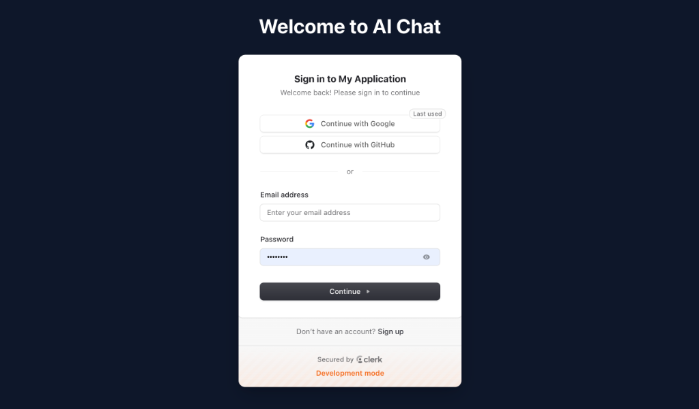
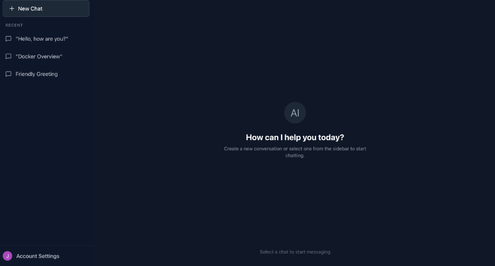
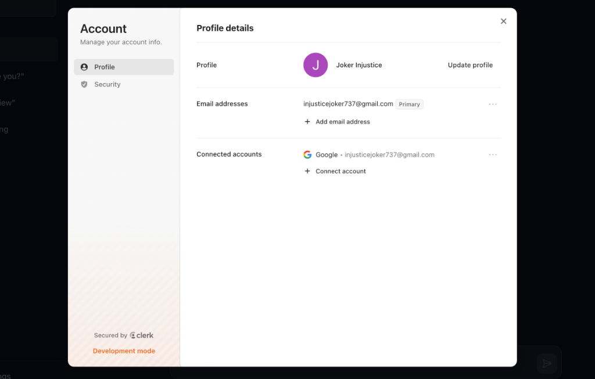
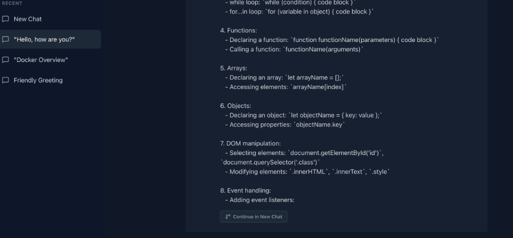

# ChatGPT Clone

A full-stack, production-ready ChatGPT clone built with React, Node.js, Express, Prisma, PostgreSQL (Neon), Clerk Authentication, and OpenAI.

## Features
- 🔐 Secure Authentication (Email/Password, Google, GitHub) via Clerk
- 💾 Persistent Chat History stored in PostgreSQL
- 📌 Pin & Unpin conversations
- 🔀 **Continue in New Chat**: Branch off a specific AI response into a completely new conversation seamlessly!
- 🎨 Beautiful Dark Mode UI inspired by ChatGPT
- ⚡ Fast Performance with Vite and React

## Screenshots

<div style="display: grid; grid-template-columns: repeat(2, 1fr); gap: 10px;">
  
  
  
  
</div>

## Setup Instructions

### 1. Database Setup
We use [Neon](https://neon.tech) for PostgreSQL.
1. Create a free account on Neon.
2. Create a new project and copy your database connection string.

### 2. Authentication Setup
We use [Clerk](https://clerk.com) for authentication.
1. Create a free account on Clerk.
2. Create a new application.
3. Go to "API Keys" and copy your Publishable Key and Secret Key.

### 3. OpenAI Setup
1. Get an API key from [OpenAI](https://platform.openai.com).

### 4. Environment Variables
#### Backend
Rename `backend/.env.example` to `backend/.env` and fill in your values:
```env
PORT=3001
DATABASE_URL="postgresql://..."
CLERK_PUBLISHABLE_KEY="pk_test_..."
CLERK_SECRET_KEY="sk_test_..."
OPENAI_API_KEY="sk-proj-..."
```

#### Frontend
Rename `frontend/.env.example` to `frontend/.env` and fill in your values:
```env
VITE_CLERK_PUBLISHABLE_KEY="pk_test_..."
VITE_API_URL="http://localhost:3001/api"
```

## How to Run This Project

Follow these steps to get the project running locally on your machine:

1. **Open your terminal** and navigate to the project root directory:
   ```bash
   cd "/Users/amit/Desktop/chat gpt clone"
   ```

2. **Install all dependencies** for the root, frontend, and backend:
   ```bash
   npm run install:all
   ```

3. **Initialize the Database**:
   Push your Prisma schema to your PostgreSQL database to create the necessary tables.
   ```bash
   cd backend
   npx prisma db push
   cd ..
   ```

4. **Start the Development Servers**:
   Run the following command to start both the frontend and backend servers simultaneously.
   ```bash
   npm run dev
   ```

5. **Open the App**:
   - The Frontend UI will be running at [http://localhost:3000](http://localhost:3000)
   - The Backend API will be running at [http://localhost:3001](http://localhost:3001)
